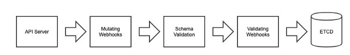

# k8s-webhooks-stuffs

- Admission webhooks are HTTP callbacks that receive admission requests and do something with them. You can define two types of admission webhooks, validating admission webhook and mutating admission webhook. Mutating admission webhooks are invoked first, and can modify objects sent to the API server to enforce custom defaults. After all object modifications are complete, and after the incoming object is validated by the API server, validating admission webhooks are invoked and can reject requests to enforce custom policies.

- Mutating Webhook:

- Validating Webhook:
    - A validating webhook is an endpoint Kubernetes can invoke prior to persisting resources in ETCD. This endpoint should return a structured response indicating whether the resource should be rejected or accepted and persisted to the datastore.

- The Flow:
    - 

## This project docker image

- For the images of this project you can see this dockerhub [repo](https://hub.docker.com/repository/docker/shahincsejnu/mutator-webhook)
- use the latest image (image >= v1.0.5)

## Setup this Mutating Webhook

```
kubectl apply -f mutating-webhook-configuration.yaml
kubectl apply -f validating-webhook-configuration.yaml
kubectl apply -f webhook-deployment.yaml
kubectl apply -f webhook-service.yaml
```

## Set Up the CA Certificate

- Once the webhook runs (give it a few seconds to initialize), the CA certificate can be downloaded by executing a curl command within the container. To retrieve the base64 encoded version of this ca.pem, use the following command:

    ```
    kubectl exec -it pods <respective_pod_name_deployed_by_mutating-webhook-deployment> sh 
    wget -q -O- http://127.0.0.1:8080/ca.pem?base64
    ```

- The output of this command should replace the base64 string in caBundle in mutating-webhook-configuration.yaml:

    ```
    caBundle: "<pre_string>"  # <= replace this string within quotes from both "mutating-webhook-configuration.yaml" and "validating-webhook-configuration.yaml"
    ```

- Then re-apply the webhook again:

    ```
    kubectl apply -f mutating-webhook-configuration.yaml
    kubectl apply -f validating-webhook-configuration.yaml
    ```
  
- Now apply the teployment object:
    ```
    kc apply -f teployment-obj.yaml
    ```
  
  

# Resources

- [x] https://www.youtube.com/watch?v=Eb9pMSCTDjI&t=1709s
- [x] https://github.com/kubernetes/api/blob/master/admissionregistration/v1/types.go
- [x] https://github.com/kubernetes/api/blob/master/admission/v1/types.go
- [x] https://www.youtube.com/watch?v=P7QAfjdbogY
- [x] https://github.com/morvencao/kube-mutating-webhook-tutorial
- [x] https://github.com/morvencao/kube-mutating-webhook-tutorial/blob/master/medium-article.md
- [x] https://medium.com/swlh/kubernetes-validating-webhook-implementation-60f3352b66a
- [x] https://github.com/wardviaene/kubernetes-course/tree/master/mutatingwebhook